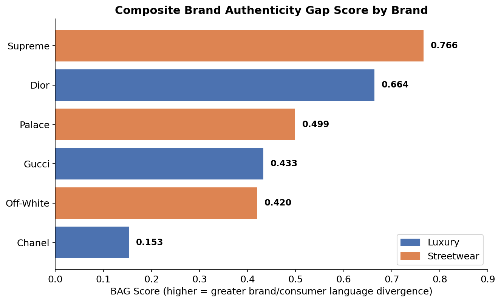

# Brand Authenticity Gap (BAG)

**A computational framework for measuring the divergence between brand-generated and consumer-generated language.**

MSc Data Science Dissertation 

---

## Overview

Brand authenticity is usually studied through surveys — how consumers *say* they
perceive a brand — rather than through direct comparison of what a brand says
about itself versus what consumers actually say about it. This project builds
the **Brand Authenticity Gap (BAG)**, a composite, reproducible score that
quantifies that divergence directly from language data, across six fashion
brands spanning two categories:

- **Luxury**: Chanel, Dior, Gucci
- **Streetwear**: Supreme, Off-White, Palace

The score combines four independent NLP dimensions — sentiment, emotion,
semantic similarity, and topic overlap — computed from ~25,500 Reddit posts and
brand-official website copy, and is validated through weighting-scheme
robustness checks, convergent validity across three independent methods, and
formal statistical significance testing around real creative-director
transitions.



## Key Findings

- **Chanel shows the smallest brand–consumer language gap** (0.153); **Supreme
  the largest** (0.766), consistently across repeated pipeline runs.
- **Streetwear brands show a larger average gap than luxury** in this sample
  (0.562 vs. 0.417) — reported descriptively (n=3 per category).
- **Luxury and streetwear diverge on different dimensions, not just degree**:
  luxury's largest gap centres on exclusivity/symbolism; streetwear's on
  price/originality — confirmed independently by two different methods
  (keyword-based aspect sentiment and zero-shot classification).
- **Creative-director transitions produce statistically significant shifts**:
  emotion-gap narrowing was significant (p<0.001) for 3 of 4 brands with
  sufficient pre/post data, tested via Mann-Whitney U, bootstrap confidence
  intervals, and two-proportion z-tests.

Full methodology, results, and limitations are in
[`docs/BAG_Dissertation_Draft.md`](docs/BAG_Dissertation_Draft.md).

## Repository Structure

```
BAG/
├── src/                    # Full pipeline, run in order
│   ├── config.py, reddit_scraper.py, trustpilot_scraper.py,
│   │   official_scraper.py, run_collection.py     # Data collection
│   ├── 01_merge_clean.py                          # Merge + clean corpus
│   ├── 02_sentiment_emotion.py                    # RoBERTa sentiment
│   ├── 02d_emotion_transformer.py                 # Transformer emotion classifier
│   ├── 03_topics_similarity.py                    # Sentence-BERT + BERTopic
│   ├── 03b_topic_overlap_fix.py                   # Outlier reduction
│   ├── 03c_weighted_overlap.py                    # Volume-weighted topic overlap
│   ├── 04_composite_bag_score.py                  # Composite BAG score
│   ├── 05_aspect_sentiment.py                     # Aspect-based sentiment (ABSA)
│   ├── 06_authenticity_dimensions.py              # Zero-shot authenticity classification
│   ├── 07_creative_director_transitions.py        # Pre/post transition analysis
│   ├── 08_transition_significance.py              # Significance testing
│   ├── 09_make_charts.py                          # Chart generation
│   ├── 10_dimension_gap_analysis.py               # Cross-brand dimension comparison
│   ├── 11_monthly_trends.py                       # Temporal trend analysis
│   └── 12_explainability_and_extra_findings.py    # Decomposition, convergent validity
├── dashboard/               # Streamlit dashboard (analyst + brand-team views)
│   ├── app.py
│   ├── pages/1_For_Brand_Teams.py
│   └── .streamlit/config.toml
├── data/processed/          # Small, aggregated result CSVs (safe to share)
├── reports/charts/          # Generated chart images
├── docs/                    # Dissertation draft, slide deck, viva prep notes
├── requirements.txt
└── .gitignore
```

## Pipeline

Run scripts in `src/` in numeric order. Each stage reads the previous stage's
output and writes its own CSV(s) — see comments at the top of each script for
exact input/output filenames.

```bash
pip install -r requirements.txt

python src/run_collection.py        # Data collection (Reddit + Trustpilot attempt)
python src/01_merge_clean.py        # Merge + clean
python src/02_sentiment_emotion.py  # Sentiment (GPU recommended)
python src/02d_emotion_transformer.py
python src/03_topics_similarity.py  # Embeddings + topics (GPU recommended)
python src/03b_topic_overlap_fix.py
python src/03c_weighted_overlap.py
python src/04_composite_bag_score.py
# ... continue through 12
```

Steps 02, 02d, 03, and 06 use transformer models and are significantly faster
on a GPU (developed and tested on Google Colab with a T4 GPU runtime). All
other steps run fine on CPU.

## Dashboard

Two views, built with Streamlit:

- **Analyst Dashboard** (`app.py`) — full methodology, statistics, and the
  recommendation engine, for a technical audience.
- **For Brand Teams** (`pages/1_For_Brand_Teams.py`) — the same findings
  translated into plain language for a non-technical marketing audience, with
  no statistics or jargon.

```bash
cd dashboard
pip install -r ../requirements.txt
streamlit run app.py
```

Requires the processed CSVs from `data/processed/` (and the additional ones
generated by `src/05`–`src/12`) in the same folder as `app.py`.

## Data Availability

Raw scraped Reddit text is **not included** in this repository — this is a
deliberate choice, not an oversight, for two reasons: file size, and respecting
that bulk-redistributing scraped user-generated content raises privacy and
platform-terms considerations beyond what's needed for reproducibility. The
**collection and processing code is fully included**, so the corpus can be
regenerated by anyone running `src/run_collection.py` onward. The small,
aggregated, non-identifying result CSVs used by the dashboard (composite
scores, contribution breakdowns, etc.) **are** included in `data/processed/`.

## Tech Stack

Python · pandas · PyTorch · Transformers (RoBERTa, DistilRoBERTa, BART-MNLI) ·
Sentence-BERT · BERTopic · scikit-learn · SciPy · Streamlit · Plotly


